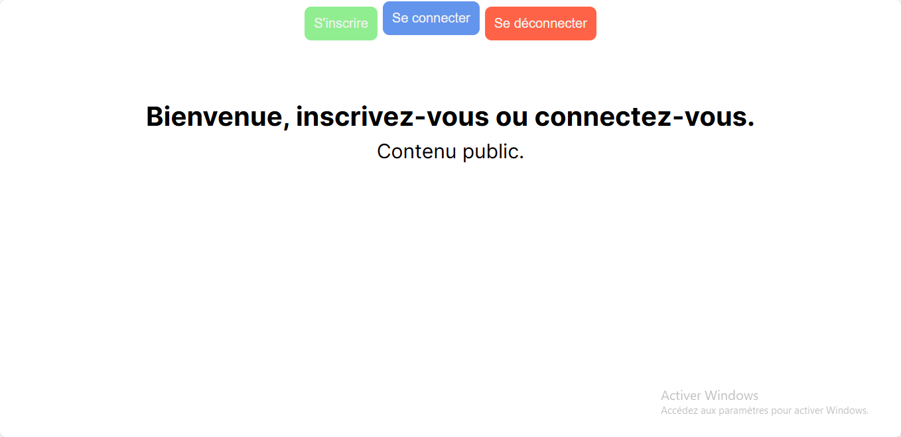

# 🔐 Firebase Authentication App

A basic authentication system built with JavaScript and Firebase Authentication. Users can sign up, log in, and log out securely using email and password.

## ✨ Features

- 📝 Sign up with email and password  
- 🔓 Log in securely  
- 🚪 Log out with a single click  
- 🛡️ Firebase handles secure user authentication  

## 🛠️ Tech Stack

- HTML  
- CSS  
- JavaScript (Vanilla)  
- [Firebase Authentication](https://firebase.google.com/products/auth)

## 📸 Preview

## 🎓 Learning Source
This project was built while following a course on Udemy as part of a training to practice handling cookies in JavaScript.

## 🚀 Getting Started

- Live Site - [Simple Auth system](https://auth-system-jet.vercel.app/)

## 👨‍💻 Author

### Grace Ariane
Frontend developer passionate about creative coding tools ✨
- linkedIn - [Grace Ariane Tchoukeu](https://www.linkedin.com/in/grace-ariane-tchoukeu)
